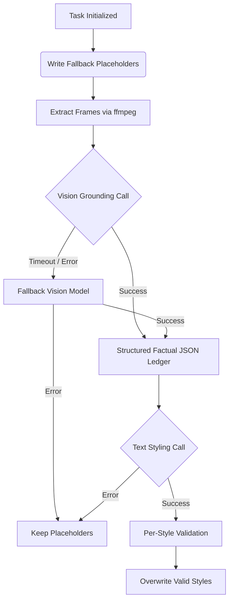

# Nami 🌊


Nami is a robust, production-grade video captioning engine built to translate sequential visual frames into highly accurate, stylistically distinct captions without falling into the hallucination traps common in generative AI.

## Why Nami?

We designed Nami based on rigorous empirical testing against a comprehensive category test set, prioritizing visual fidelity and architectural reliability over aggressive prompt engineering. 

- **Decoupled Architecture:** Nami isolates visual extraction from persona-based styling. A vision model produces a strictly factual ledger, and a separate text model adopts the requested personas (Formal, Sarcastic, Humorous Tech, Humorous Non-Tech). This strictly prevents the system from inventing non-existent details just to service a joke.
- **Fail-Safe Reliability:** Nami is aggressively instrumented with hard subprocess timeouts for ffmpeg, dynamic LLM API timeouts that strictly adhere to a 30s/clip budget, and a placeholder-first guarantee. If any stage crashes, a valid fallback response is already on disk.
- **Per-Style Partial Credit:** Our validation system checks each generated style independently. If one style fails length limits or hallucinates, only that style falls back—saving valid captions from being unnecessarily discarded.

Read the details in our [Evaluation Methodology](docs/EVALUATION.md) and [Reliability & Failure Modes](docs/RELIABILITY.md) docs.

## Architecture

Nami runs a Two-Pass Pipeline with Pre-Emptive Fallback:



For a deeper dive into the reasoning behind this design, see the [Architecture Document](docs/ARCHITECTURE.md) and [Decision Log (ADR)](docs/DECISIONS.md).

## Quickstart

### Prerequisites

- Python 3.11+
- `ffmpeg` and `ffprobe` installed and on your PATH.
- Fireworks AI API Key (Set as `FIREWORKS_API_KEY`).

### Local Execution

```bash
# 1. Install dependencies
pip install -r requirements.txt

# 2. Set environment variables
export PYTHONPATH="$(pwd)"

# 3. Run the pipeline
python docker/entrypoint.py
```

### Docker Execution

```bash
docker build -f docker/Dockerfile -t nami:latest .

docker run -v $(pwd)/input:/input -v $(pwd)/output:/output \
  -e FIREWORKS_API_KEY="<YOUR_KEY>" \
  nami:latest
```

## Documentation

- [Architecture](docs/ARCHITECTURE.md)
- [Architecture Decision Log (ADR)](docs/DECISIONS.md)
- [Evaluation & Test Results](docs/EVALUATION.md)
- [Reliability & Failure Modes](docs/RELIABILITY.md)
